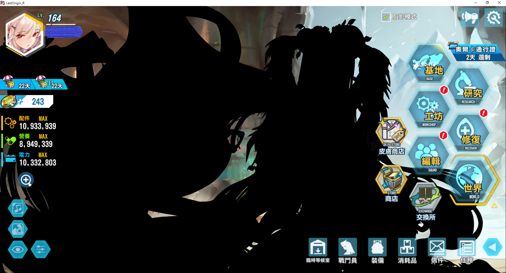

# LastOrigin Localization Mod

This project is a LastOrigin Localization Mod. It can change your LastOrigin to Chinese Trandictional or English.

## Install guide

1. Install [BepInEx6](https://github.com/BepInEx/BepInEx/releases) BepInEx_UnityIL2CPP_x64_6.0.0-pre.1.zip
2. Run Game Once. This steup will hang a minute. If you watching the Game UI, you will found `BepInEx\plugins` dir is generate. Then close the game.
3. Extract all plugin and plugin data into `BepInEx\plugins`. (Include Localization dir)

## Config guide

The config file is place in `BepInEx\config\LOLocalization.cfg`.

Default language is tc, if you want change your language to English, Edit config file and restart game.

```
## Settings file was created by plugin LOLocalization v1.0.3
## Plugin GUID: LOLocalization

[General]

## Accept tc,en
# Setting type: String
# Default value: tc
language = tc

## Accept sourcehansans,msjhbd
# Setting type: String
# Default value: sourcehansans
font = sourcehansans
```

## Community Translation

You can co-editing these sheets to help us.

[UI](https://docs.google.com/spreadsheets/d/16uL75K1GSrHEx_lGUx1GHTlG6KKhaaxMgGsvUqi6fss/edit#gid=0)
[Text](https://docs.google.com/spreadsheets/d/1Ck3LS2bIOPI_aanuikXzgXleSRqMqg9H27mZTVnqBdY)

## Example




## Fixed some bugs.

### Text slim bugs:


### ERROR#0 Bug:


### Translation bugs


